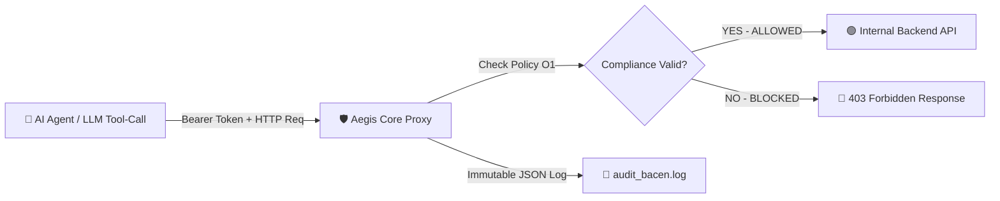

<div align="center">
  <h1>🛡️ Aegis Core</h1>
  <p><strong>The Open-Core Compliance & Security Shield for Autonomous AI Agents.</strong></p>
  <p><em>PoC Policy Engine built around CMN 5.274 / BACEN 538/2025, LGPD, and CFM regulatory frameworks.</em></p>
  
  [](https://opensource.org/licenses/MIT)
  [](https://golang.org/)
  [](https://github.com/pedrodawybida/aegis-core/actions)
  [](#)
  [](#)
</div>

<div align="center">
  <strong>English | <a href="README.pt-BR.md">Português</a></strong>
</div>

<br />

## 🚨 The Problem
Autonomous AI agents (LangChain, CrewAI, AutoGen, LlamaIndex) rely on *Tool-Calling* to execute actions on internal databases and APIs. Providing unsupervised access to an LLM directly violates fundamental cybersecurity and data privacy regulations:
- **CMN Resolution No. 5.274/2025 & BCB 538/2025:** Mandate strict traceability, non-human identity authentication, and immutable audit logging for cyber actions in financial institutions.
- **LGPD (Brazilian General Data Protection Law):** Enforces data minimization and guards against unauthorized bulk data extraction.

## 💡 The Solution
**Aegis Core** is an ultra-low latency HTTP reverse proxy (written in Go, overhead < 0.1ms) positioned between your AI Agents and your backend APIs.

Aegis verifies every incoming request against *Compliance Policy Templates* and **proactively blocks destructive actions or data leaks**, generating immutable JSON audit logs ready for regulatory inspection.



---

## ⚡ Interactive 5-Second Demo

Run the interactive demo script to see Aegis block non-compliant agent requests in real time:

```bash
make demo
# or
./demo.sh
```

---

## 🚀 Quickstart

### 1. Define Policy Configuration (`aegis.yaml`)
Define permissions for each non-human AI identity:
```yaml
target_api: "http://localhost:9000" 

agents:
  # Fintech Support Agent
  - id: "ia-fintech-support"
    modes:
      - "LGPD"      # Blocks bulk GET operations on customer endpoints
      - "BACEN_538" # Blocks unapproved state mutations (DELETE/PUT)
  
  # HealthTech Bot
  - id: "ia-health-bot"
    modes:
      - "CFM"       # Restricts access to medical records without oversight
```

### 2. Run via Docker
```bash
docker build -t aegis-core .
docker run -p 8080:8080 -d aegis-core
```

### 3. Run Locally via Makefile
```bash
make build
make run
```

---

## 🛠️ Makefile Commands

| Command | Description |
| :--- | :--- |
| `make build` | Compiles the executable binary into `bin/aegis` |
| `make test` | Runs the full unit and integration test suite |
| `make test-race` | Runs tests with Go's Data Race detector enabled |
| `make run` | Runs Aegis Core proxy locally |
| `make docker-build` | Builds the container Docker image |
| `make demo` | Executes the interactive demonstration script |

---

## ⚙️ Environment Variables & CLI Flags

Configure Aegis Core via command-line flags or environment variables:

| Environment Variable | CLI Flag | Default | Description |
| :--- | :--- | :--- | :--- |
| `AEGIS_PORT` | `-port` | `8080` | Port for the proxy server listener |
| `AEGIS_CONFIG` | `-config` | `aegis.yaml` | Path to YAML configuration file |
| `AEGIS_LOG_FILE` | `-log` | `audit_bacen.log` | Path to append-only immutable audit log file |
| `AEGIS_TARGET_API` | - | `http://localhost:9000` | Target internal backend API URL |
| `AEGIS_DRY_RUN` | `-dry-run` | `false` | Enable Dry-Run (Shadow / Audit-Only) Mode without blocking requests |

---

## 🏥 Health Check & System Endpoints

Aegis exposes native system endpoints requiring no agent identity token:

- `GET /_aegis/health` (or `/healthz`): Returns service operational status and active agent count.
- `GET /_aegis/dashboard`: Opens the embedded visual Web Console for live testing.
- HTTP responses include the `X-Aegis-Compliance-Status` header specifying `ALLOWED` or the exact violation reason.

---

## 📺 Embedded Visual Web Console

Open `http://localhost:8080/_aegis/dashboard` in your browser to inspect loaded policies, test live request simulations, and view audit trail status out of the box.

---

## 🧪 Automated Testing & Benchmarking

Run the complete test suite with race detection and latency benchmarking:
```bash
# Run unit & integration tests
go test -v -race ./...

# Run proxy latency benchmarks
go test -bench=. -benchmem ./internal/proxy
```

---

## 📜 Audit Logs Ready for Auditors
Every request attempt appends an immutable, thread-safe JSON entry to `audit_bacen.log`:

```json
{
  "timestamp": "2026-07-27T14:22:35Z",
  "agent_id": "ia-fintech-support",
  "action": "DELETE /transacoes/99",
  "tool_payload": "",
  "result": "BLOCKED_BACEN_538_MUTATION_DENIED",
  "ip_address": "127.0.0.1:54569"
}
```

---

## 🏛️ Production Architecture Notes

**Aegis Core** is designed as a lightweight, high-performance Policy Engine for non-human identity security.

- **Identity & Authentication:** In the Core engine, agent tokens are evaluated in-memory via `aegis.yaml`. In enterprise production, Aegis sits behind API Gateways / Service Meshes (Kong, Envoy, Ambassador) delegating auth to mTLS, JWT/OIDC, or OAuth2.
- **Rule Engine:** The `compliance` package implements default policy rules for BACEN 538/2025, LGPD, and CFM, extensible for JSON Schema validation, payload inspection, and dynamic regex matching.

---

## 🏢 Enterprise Edition
This repository contains the Open-Source Core engine under the MIT License.

For enterprise production deployments in Banks and Fintechs, we offer:
- **Visual Web Admin:** Centralized web management dashboard for CISOs and compliance auditors.
- **Automated PDF Audit Reports:** Single-click compliance evidence PDF generation for Central Bank audits.
- **SSO & RBAC:** Microsoft Entra ID, Okta, and Keycloak integration.
- **SLA & 24/7 Enterprise Support.**

👉 **[Contact us to schedule an Enterprise Edition demo](mailto:pedro@aegisbr.com?subject=Aegis%20Enterprise%20Interest)**
