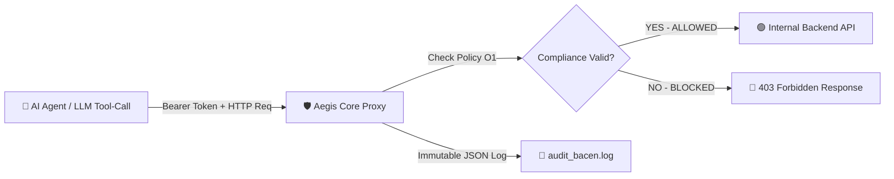

<div align="center">
  <h1>🛡️ Aegis Core</h1>
  <p><strong>The Open-Core Compliance & Security Shield for Autonomous AI Agents.</strong></p>
  <p><em>PoC Policy Engine built around CMN 5.274 / BACEN 538/2025, LGPD, and CFM regulatory frameworks.</em></p>
  
  [](#)
  [](https://opensource.org/licenses/MIT)
  [](https://golang.org/)
  [](https://github.com/pedrodawybida/aegis-core/actions)
</div>

<div align="center">
  <strong><a href="README.md">English</a> | Português</strong>
</div>

<br />

## 🚨 O Problema
Agentes de IA autônomos (LangChain, CrewAI, AutoGen, LlamaIndex) utilizam *Tool-Calling* para executar ações em bancos de dados e APIs internas. Dar acesso não-supervisionado a uma IA viola diretamente os controles mínimos de cibersegurança exigidos por reguladores brasileiros:
- **Resoluções CMN nº 5.274/2025 e BCB 538/2025:** Exigem rastreabilidade absoluta, autenticação de identidades não-humanas e log imutável de ações cibernéticas em instituições financeiras.
- **LGPD (Lei Geral de Proteção de Dados):** Exige o princípio da minimização de dados e proteção contra extração não autorizada em massa.

## 💡 A Solução
**Aegis Core** atua como um *Reverse Proxy* de ultrabaixa latência (escrito em Go, latência < 3ms) posicionado entre os seus Agentes de IA e as suas APIs de backend.

O Aegis verifica se a ação solicitada viola os *Templates de Compliance BR* e **bloqueia proativamente ações destrutivas ou vazamentos**, gerando logs estruturados e imutáveis prontos para a auditoria do Banco Central.



---

## ⚡ Demonstração Interativa em 5 Segundos

Execute o script interativo para testar o Aegis bloqueando requisições não conformes em tempo real:

```bash
make demo
# ou
./demo.sh
```

---

## 🚀 Como Iniciar (Quickstart)

### 1. Crie a Configuração (`aegis.yaml`)
Defina as permissões de cada agente:
```yaml
target_api: "http://localhost:9000" 

agents:
  # Agente de Suporte Fintech
  - id: "ia-fintech-support"
    modes:
      - "LGPD"      # Bloqueia GET em massa em rotas de clientes
      - "BACEN_538" # Bloqueia mutações destrutivas (DELETE/PUT) sem homologação
  
  # Agente de Saúde (HealthTech)
  - id: "ia-health-bot"
    modes:
      - "CFM"       # Proíbe acesso a prontuários médicos sem validação humana
```

### 2. Rodando via Docker (Conteinerizado)
```bash
docker build -t aegis-core .
docker run -p 8080:8080 -d aegis-core
```

### 3. Rodando Localmente com Makefile
```bash
make build
make run
```

---

## 🛠️ Comandos do Makefile

| Comando | Descrição |
| :--- | :--- |
| `make build` | Compila o executável `bin/aegis` |
| `make test` | Executa a suíte de testes unitários e de integração |
| `make test-race` | Executa testes com detector de *Data Race* ativo |
| `make run` | Executa o proxy localmente |
| `make docker-build` | Constrói a imagem Docker do Aegis Core |
| `make demo` | Executa a demonstração prática interativa |

---

## ⚙️ Variáveis de Ambiente & Flags CLI

Você pode configurar o Aegis Core via argumentos de linha de comando ou variáveis de ambiente:

| Variável de Ambiente | Flag CLI | Padrão | Descrição |
| :--- | :--- | :--- | :--- |
| `AEGIS_PORT` | `-port` | `8080` | Porta onde o servidor proxy escutará |
| `AEGIS_CONFIG` | `-config` | `aegis.yaml` | Caminho do arquivo de configuração YAML |
| `AEGIS_LOG_FILE` | `-log` | `audit_bacen.log` | Caminho do arquivo de log imutável |
| `AEGIS_TARGET_API` | - | `http://localhost:9000` | URL da API interna de destino protegida |

---

## 🏥 Endpoints de Saúde e Diagnósticos

O Aegis expõe endpoints de sistema nativos sem necessidade de token de agente:

- `GET /_aegis/health` (ou `/healthz`): Retorna status operacional do serviço e quantidade de políticas ativas.
- `GET /_aegis/dashboard`: Abre o Console Web Visual em tempo real para testes e auditoria.
- Respostas HTTP contêm o cabeçalho `X-Aegis-Compliance-Status` indicando `ALLOWED` ou o motivo exato do bloqueio.

---

## 📺 Console Web Visual Embutido

Acesse `http://localhost:8080/_aegis/dashboard` diretamente no navegador para testar requisições dos agentes, visualizar os cartões de políticas ativas e validar simulações em tempo real sem precisar instalar nada além do Aegis.

---

## 🧪 Testes Automatizados

Para executar os testes automatizados com detector de race condition:
```bash
go test -v -race ./...
```

---

## 📜 Logs de Auditoria Prontos para o Regulador
Qualquer tentativa de acesso gera um log JSON imutável e thread-safe no arquivo `audit_bacen.log`.

```json
{
  "timestamp": "2026-07-27T14:22:35Z",
  "agent_id": "ia-fintech-support",
  "action": "DELETE /transacoes/99",
  "tool_payload": "",
  "result": "BLOCKED_BACEN_538_MUTATION_DENIED",
  "ip_address": "127.0.0.1:54569"
}
```

---

## 🏛️ Arquitetura & Considerações de Produção

O **Aegis Core** foi projetado como um motor de políticas (*Policy Engine Proof-of-Concept*) leve, conciso e extensor para segurança de identidades não-humanas.

- **Identidade & Autenticação:** No motor Core, o token do agente é validado em memória via arquivo `aegis.yaml`. Em ambientes de produção corporativos, o Aegis opera integrado a API Gateways / Service Mesh (Kong, Envoy, Ambassador) delegando autenticação para mTLS, JWT/OIDC ou OAuth2.
- **Motor de Regras:** O pacote `compliance` implementa regras base para BACEN 538/2025, LGPD e CFM, podendo ser estendido para validação dinâmica de esquemas JSON, validação de payload e regex dinâmicos.

---

## 🏢 Licença Enterprise
Este repositório contém o motor (*Core*) Open-Source sob licença MIT.

Para a versão Corporativa (*Enterprise Edition*), oferecemos:
- **Painel Visual Web:** Gerenciamento centralizado de políticas por CISO e auditores.
- **Relatórios Automatizados em PDF:** Geração de relatórios de auditoria com 1 clique para entrega ao Banco Central.
- **SSO & RBAC:** Integração com Microsoft Entra ID, Okta e Keycloak.
- **SLA e Suporte 24/7.**

👉 **[Fale conosco e agende uma demonstração da versão Enterprise](mailto:pedro@aegisbr.com?subject=Interesse%20Aegis%20Enterprise)**
